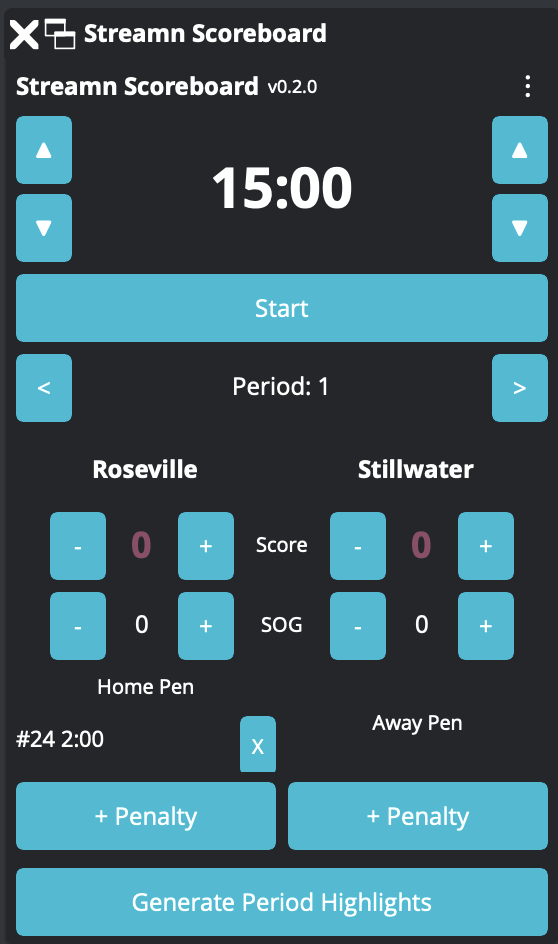
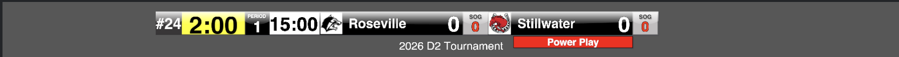

# Streamn Scoreboard for OBS Studio

[](https://github.com/StreamnDad/streamn-scoreboard/actions/workflows/build.yml)
[](https://github.com/StreamnDad/streamn-scoreboard/actions/workflows/build.yml)
[](https://www.gnu.org/licenses/old-licenses/gpl-2.0.en.html)

OBS Studio plugin that tracks youth hockey scoreboard state and writes it to individual text files. Users compose their scoreboard overlay in OBS using standard Text (GDI+/FreeType) sources pointed at these files.

<p align="center">
  
</p>

## Features

- **12 text files** updated in real-time: clock, period, scores, shots, team names, penalties
- **Dock UI** with full scoreboard controls in an OBS dock panel
- **22 OBS hotkeys** for hands-free operation during broadcasts
- **Penalty tracking** with automatic countdown timers (2 slots per team)

Build your own scorebug overlay using OBS Text sources pointed at the output files:



## Compatibility

- **OBS Studio** 30.0+ (uses Qt5 dock API)
- **macOS** (Apple Silicon and Intel)
- **Windows** (x64)
- **Linux** (x86_64)
- C11 / C++17

## Installation

Download the latest release for your platform from the [Releases](https://github.com/StreamnDad/streamn-scoreboard/releases) page. Each download contains a single plugin file (`.so`, `.dll`, or `.pkg`) that you copy into your OBS plugins folder.

For general information about installing OBS plugins, see the [OBS Plugins Guide](https://obsproject.com/kb/plugins-guide).

### macOS

1. Download `streamn-obs-scoreboard-x.y.z-macos.pkg`
2. Double-click the `.pkg` file and follow the installer prompts
3. Restart OBS Studio

The installer places the plugin in `~/Library/Application Support/obs-studio/plugins/streamn-obs-scoreboard/bin/`.

### Windows

1. Download `streamn-obs-scoreboard-x.y.z-windows-x64.zip`
2. Extract the zip — it contains `obs-plugins/64bit/streamn-obs-scoreboard.dll`
3. Copy `streamn-obs-scoreboard.dll` to your OBS plugins folder:
   - **Recommended:** `C:\ProgramData\obs-studio\plugins\streamn-obs-scoreboard\bin\64bit\`
   - **Alternative:** `C:\Program Files\obs-studio\obs-plugins\64bit\`
4. Restart OBS Studio

### Linux

1. Download `streamn-obs-scoreboard-x.y.z-linux-x86_64.tar.gz`
2. Extract the archive — it contains `obs-plugins/streamn-obs-scoreboard.so` (this is a shared library, the Linux equivalent of a `.dll`)
3. Copy `streamn-obs-scoreboard.so` to your OBS plugins folder:
   - **Per-user:** `~/.config/obs-studio/plugins/streamn-obs-scoreboard/bin/64bit/`
   - **System-wide:** `/usr/lib/obs-plugins/`
4. Restart OBS Studio

### After installation

1. Open OBS Studio — the plugin loads automatically on startup
2. Go to **View > Docks > Streamn Scoreboard** to enable the dock panel
3. Dock it wherever you like in the OBS interface (drag the title bar to snap it into place)

### Building from source

```bash
# macOS
make setup                    # Install prerequisites (requires Homebrew)
make find-obs-dev-paths       # Discover local OBS header/lib paths
make dev OBS_INCLUDE_DIR=/path/to/obs/include OBS_LIBRARY=/path/to/libobs
make install

# Linux
sudo apt install libobs-dev qtbase5-dev libsimde-dev ninja-build
cmake --preset linux
cmake --build build
ctest --test-dir build

# Windows (requires Visual Studio 2022, Qt5, OBS SDK)
cmake --preset windows -DOBS_INCLUDE_DIR=... -DOBS_LIBRARY=... -DCMAKE_PREFIX_PATH=...
cmake --build build --config RelWithDebInfo
ctest --test-dir build -C RelWithDebInfo
```

## Text Files

Set an output directory in the dock settings. The plugin writes these files on every tick (~100ms):

| File | Content | Example |
|------|---------|---------|
| `clock.txt` | Game clock | `12:45` |
| `period.txt` | Current period | `2` / `OT` |
| `home_name.txt` | Home team name | `Eagles` |
| `away_name.txt` | Away team name | `Hawks` |
| `home_score.txt` | Home score | `3` |
| `away_score.txt` | Away score | `1` |
| `home_shots.txt` | Home shots on goal | `18` |
| `away_shots.txt` | Away shots on goal | `12` |
| `home_penalty_numbers.txt` | Home penalty player numbers | `#12 #7` |
| `home_penalty_times.txt` | Home penalty times remaining | `1:32 0:45` |
| `away_penalty_numbers.txt` | Away penalty player numbers | `#19` |
| `away_penalty_times.txt` | Away penalty times remaining | `0:22` |

## Hotkeys

All 22 hotkeys are prefixed with "Streamn:" in OBS Settings > Hotkeys:

| Hotkey | Action |
|--------|--------|
| Clock Start/Stop | Toggle game clock |
| Clock Reset | Reset clock to period length |
| Clock +1 Min / -1 Min | Adjust clock by 1 minute |
| Clock +1 Sec / -1 Sec | Adjust clock by 1 second |
| Home/Away Goal +/- | Adjust score (4 hotkeys) |
| Home/Away Shot +/- | Adjust shots (4 hotkeys) |
| Period Advance / Rewind | Change period |
| Home/Away Penalty Add | Add 2:00 minor penalty |
| Home/Away Penalty Clear 1/2 | Clear penalty slot (4 hotkeys) |

## Development

```bash
make dev          # configure + build + test (full cycle)
make coverage     # enforce 100% line coverage on scoreboard-core
make release      # build macOS .pkg installer
make clean        # remove build artifacts
```

### Architecture

Two-layer design separating testable core logic from OBS-dependent code:

- **scoreboard-core** (C static library) — pure game state management, file output, no OBS dependencies
- **OBS module** (C/C++ shared library) — dock UI, hotkeys, OBS integration

Tests are plain C using `assert()` with 100% line coverage on the core library.

## License

This project is licensed under the GNU General Public License v2.0 — see [LICENSE](LICENSE) for details. GPLv2 is required because the plugin links against libobs (GPLv2).
